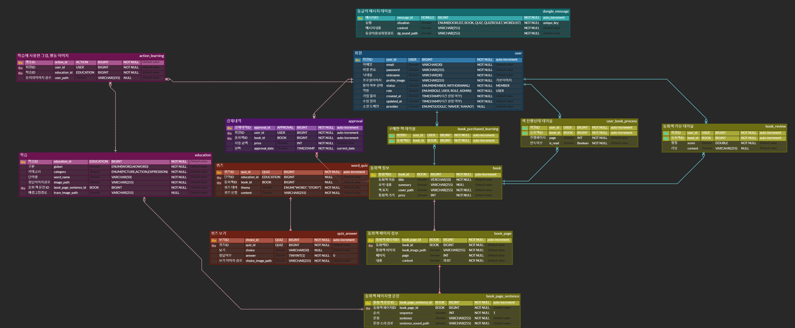

# :tada: SSAFY 10기 특화프로젝트 광주 1반 최우수상 수상 :tada:

# 웹/모바일(웹 IoT) 프로젝트

<!-- 필수 항목 -->

## 카테고리

| Application                          | Domain                                | Language                         | Framework                            |
| ------------------------------------ | ------------------------------------- | -------------------------------- | ------------------------------------ |
| :black_square_button: Desktop Web    | :white_check_mark: AI                 | :black_square_button: JavaScript | :black_square_button: Vue.js         |
| :black_square_button: Mobile Web     | :black_square_button: Big Data        | :black_square_button: TypeScript | :black_square_button: React          |
| :black_square_button: Responsive Web | :black_square_button: Blockchain      | :black_square_button: C/C++      | :black_square_button: Angular        |
| :white_check_mark: Android App       | :black_square_button: IoT             | :black_square_button: C#         | :black_square_button: Node.js        |
| :black_square_button: iOS App        | :black_square_button: AR/VR/Metaverse | :white_check_mark: ​Python        | :black_square_button: Flask/Django   |
| :black_square_button: Desktop App    | :black_square_button: Game            | :white_check_mark: Java          | :white_check_mark: Spring/Springboot |
|                                      |                                       | :black_square_button: Kotlin     | :white_check_mark: Flutter           |
|                                      |                                       | :white_check_mark: Dart          | :white_check_mark: PastApi           |

<!-- 필수 항목 -->

## 프로젝트 소개

#### 1. 프로젝트명

동글이

#### 2. 프로젝트 기간

2023.02.19 ~ 2024.04.05 (7주)

#### 3. 서비스 특징

AI 기술을 활용한 참여형 전자 동화책

#### 4. 주요 기능

- 학습한 단어를 도감화
    - 책을 읽는 도중 학습한 단어를 카드형식으로 저장하고 도감에 등록한다.

- 부트페이를 사용한 결제 시스템
    - 부트페이 API를 활용하여 다양한 결제 방식을 통한 결제를 지원한다.

- 단순 학습이 아닌 그림과 행동을 통한 참여형식의 동화책
    - 동화를 읽는 중 문제에 알맞는 그림을 그려 정답 여부를 확인하고 동화책을 진행한다.
    - 동화를 읽는 중 문제에 알맞는 표정을 통해 정답 여부를 확인하고 동화책을 진행한다.
    - 동화를 읽는 중 문제에 알맞는 행동을 통해 정답 여부를 확인하고 동화책을 진행한다.

- 퀴즈
    - 읽은 동화책에 대한 퀴즈를 진행할 수 있다.
    - 학습한 단어 카드에 대한 퀴즈를 진행할 수 있다.

## 팀 소개

<!-- 자유 양식 -->

## 사용 기술 스택

#### 1. FE
- Android Studio
    - Hedgehog 2023.1.1 Patch 2

- Flutter 3.19.1

#### 2. BE
- OpenJDK 17

- Spring Boot 3.2.2
    - Project : Gradle - Groovy

#### 3. DB
- MYSQL 8.0.35

#### 4. INFRA
- Docker : 25.0.2

- DockerHub

- Jenkins : 2.441

- nginx : 1.18(Ubuntu)

#### 5. AI
- Famework : Tensorflow

- 가상환경 : Annaconda

- Library : Keras

- Model : Sequential, CNN

## 서비스 화면
### 메인 페이지

### 동화책
#### 동화책 선택 시 화면

#### 동화책 다운 시 로딩 화면

#### 동화책 진행 시 화면

#### 첫 완독 시 리뷰 모달

### 동화책 진행 시 퀴즈
#### 그림 퀴즈

#### OX 퀴즈

#### 표정 퀴즈

### 동화책 퀴즈 / 단어 퀴즈

### 단어장
#### 잠긴 단어장

#### 단어 획득 후 단어장

#### 단어 카드 상세 화면

### 마이페이지
#### 내 리뷰 확인하기

#### 동화 구매 전

#### 동화 구매 후

#### 동화 구매 페이지

#### 내 리뷰 수정 / 삭제 및 정보 수정 페이지

## [기능 명세서](https://www.notion.so/f40c295cacd44fab9a7d1d7e77edf077)

## [요구 사항 명세서](https://www.notion.so/2113837274fa42b1b8d85bccaf2f8d62)

## [REST API 연동 규격서](https://www.notion.so/Rest-API-78591cf515254e0c9ce22bee554e17eb)

## [빌드 및 배포 관련 문서](https://www.notion.so/77a69144a47b413c98b7d44084320b54)

#### ERD

#### 시스템 아키텍쳐

